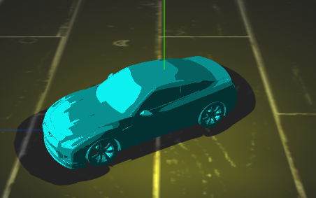

## 百度前端学院 TASK列表

#### [WebGL No.1 - Three.js 入门](https://cloudsere.github.io/task001_webgl/)

我的第一个three.js小车

#### [自定义checkbox， radio样式](https://cloudsere.github.io/task002_checkboxStyle/)

用伪元素和雪碧图实现自定义checkbox 和 radio 样式

#### [自定义网页右键菜单](https://cloudsere.github.io/task003_menu/)

右键菜单

#### [ECharts NO.1 ](https://cloudsere.github.io/task005_simpleEchart/)

关于电影排片和票房的可视化，非常简单的柱形图和折线图叠加

#### [正则表达式之入门](https://cloudsere.github.io/task004_reg/)

检测用户输入是否是手机号码

#### [网页抓取分析服务系列之一](https://github.com/cloudsere/task006_phantomjs)

phantomJs 实现输入关键词抓取百度第一页内容

#### [网页抓取分析服务系列之二](https://github.com/cloudsere/task007_phantomjs)

在系列一的基础上加上设备的判断

#### [无限滚动效果](https://cloudsere.github.io/task008_infinitescroll/)

一个非常简单的无限加载滚动效果 

#### [WebGL No. 2 - 光与影](https://cloudsere.github.io/ife-task-gallery/task009/index.html)

我的第二个小车

#### [WebGL No. 3 - 材质与纹理](https://cloudsere.github.io/ife-task-gallery/task010/index.html)

我的小车有纹理了！

#### [WebGL No. 4 - 照相机和交互](https://cloudsere.github.io/ife-task-gallery/task011/index.html)

可以转着看我的小车

#### [WebGL No.5 - 动画](https://cloudsere.github.io/ife-task-gallery/task012/index.html)

可以操控我的小车前后左右走了

#### [任务三：三栏式布局](https://cloudsere.github.io/ife-task-gallery/task013/index.html)

css练手之三栏式布局

#### [任务四：定位和居中](https://cloudsere.github.io/ife-task-gallery/task014/index.html)

css练手之在div里画两个圈圈

#### [任务五：零基础HTML及CSS编码（二）](https://cloudsere.github.io/ife-task-gallery/task015/index.html)

实现一个简易的博客界面

#### [ECharts NO.2 - 实现自定义的统计图表](https://cloudsere.github.io/ife-task-gallery/task017/index.html)

echart简单练习又一个

#### [任务三：零基础JavaScript编码（三）](https://cloudsere.github.io/ife-task-gallery/task019/index.html)

点击排序

#### [ECharts No.4 - 可视化前的数据预处理](https://cloudsere.github.io/ife-task-gallery/task018/index.html)

用node.js做可视化前的预处理

#### [WebGL No.6 - 外部模型](https://cloudsere.github.io/ife-task-gallery/task021-ObjectLoader/index.html)

我的小车。。变成奥迪了！

#### [WebGL No.7 - 着色器](https://cloudsere.github.io/ife-task-gallery/task022-ShaderMaterial/index.html)

是的，现在车是这样

